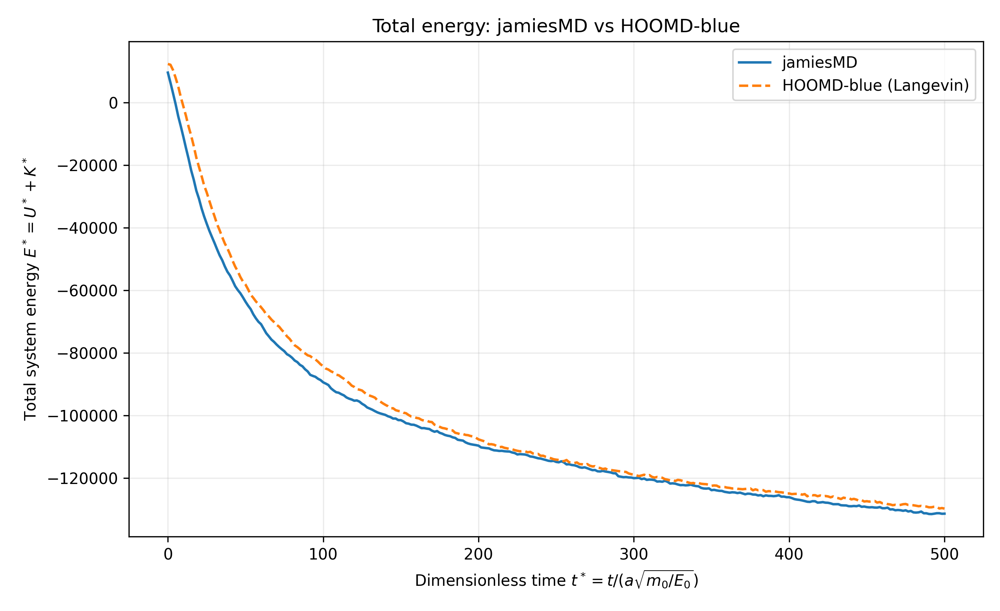
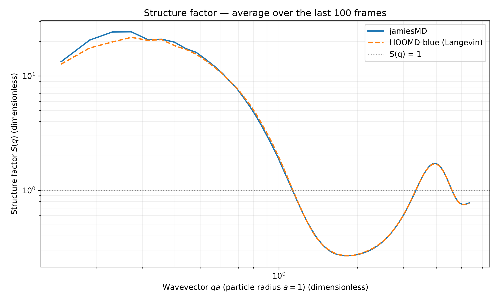

# jamiesMD

> A simple molecular dynamics simulator

---

## Table of Contents

1. [Installation, Compilation, and Usage](#installation-compilation-usage)
2. [Energy Comparison with HOOMD-blue](#energy-comparison)
3. [SAXS Comparison with HOOMD-blue](#structure-factor-comparison)
4. [Current Assumptions and Limitations](#assumptions-limitations)
5. [Future Implementation and Improvements](#future-improvements)
6. [Generative AI Assistance](#generative-ai-assistance)

---

<a id="installation-compilation-usage"></a>

## 1. Installation, Compilation, and Usage

### Requirements

- CUDA-capable NVIDIA GPU
- NVCC compiler 13.0+
- C++ compiler with C++23 support (and compatible with NVCC version)
- CMake 3.25.1+
- mathdx for cuRANDdx (already included)
- (For generating example comparisons only) hoomd-blue 2.x+ https://github.com/glotzerlab/hoomd-blue, saxs-fft https://github.com/hansoncjc/saxs-fft, Python 3.0+, matplotlib

### Installation

Clone the repository and check compiler/cmake versions
```bash
git clone https://github.com/JamieStenwick/jamiesMD.git
g++ --version
nvcc --version
cmake --version
```

### Build and Compilation

If your CMake version is on the older side it may not have automatic CUDA/CXX language detection flags, which need to be set explicitly with 
```bash
target_compile_options(jamiesMD PRIVATE
    $<$<COMPILE_LANGUAGE:[CUDA/CXX]>:-std=c++[20/23]>
)
```

Build and compile in cwd with
```bash
cmake -S . -B build
cmake --build build
```

### Command-Line Arguments

| Argument | Description | Example |
|---|---|---|
| `dt` | integration time step | `1e-4` |
| `vol_frac` | fraction of box volume occupied by particles | `0.01` |
| `kT` | thermal energy | `1` |
| `N` | number of particles | `8000` |
| `timeTotal` | total integration time | `500` |
| `frames` | number of frames to write (start and end inclusive) | `301` |
| `epsilon` | LJ well depth parameter | `5.0` |
| `sigma` | LJ length parameter | `1.782` |

### A note on units

The non-dimensionalization convention in the source code chooses 3 independent units:
1. Length, reference value $L_0=a$ (particle radius)
2. Mass, reference value $M_0=\mu_0$ (particle mass)
3. Energy, reference value $E_0=kT_{ref}$ (thermal energy at a chosen reference temperature)

All other units are derived from these, and the dimensional quantities can be recovered by multiplying the non-dimensional values by their matching units derived from these 3 choices.
#### Example with drag
$$
\begin{aligned}
\gamma &[=] \frac{\text{Mass}}{\text{Time}} \\
\gamma^* &= \frac{\gamma}{\gamma_0} \\
\gamma_0 &= \frac{M_0}{\tau_0}
\end{aligned}
$$

Where $\tau_0$ is the derived time unit, which from dimensional analysis is

$$
\tau_0 = a\sqrt{\frac{\mu_0}{E_0}}
$$

To recover the dimensional drag coefficient for a given simulation, multiply the dimensionless quantity $\gamma^*$ passed to the simulator by the derived unit:

$$
\gamma = \gamma^{*}\gamma_0
$$

$$
\gamma = \gamma^{*}\frac{\mu_0}{a\sqrt{\frac{\mu_0}{E_0}}}
$$

### Example Run

```bash
build/jamiesMD 1e-4 0.01 1 8000 500 301 5.0 1.782
```

With writeEnergy=true in the integrate() function, a positions.txt and energies.txt will be output to the cwd.
positions.txt contains N*frames rows, where each row is an individual particles' x, y, z coordinates grouped by particleID's. So the first N rows are the coordinates for particleID's 0->N-1 for frame 1, then 0->N-1 for frame 2, etc.

---

<a id="energy-comparison"></a>

## 2. Energy Comparison with HOOMD-blue

A sample simulation with a LJ-potential using HOOMD's langevin integrator was run to compare results. It should be noted I'm only comparing with hoomd-blue (as opposed to another MD simulator) because it's a package used by the lab I participate in for my undergraduate research project.

### Comparison Conditions

| Parameter | value |
|---|---:|
| Number of particles | 8000 |
| dt | 1e-4 |
| kT | 1 |
| totalTime | 500 |
| frames | 301 |
| epsilon | 5.0 |
| sigma | 1.782 |

### Total Energy Comparison

In jamiesMD, the total energy is calculated by summing the pair interaction energies (without double counting) and the kinetic energies of each particle after each complete BAOAB time step. Kinetic energy has only translational DOF's in jamiesMD.



*Figure 1. Total dimensionless energy over time, the kinetic energies for both simulations stayed constant, while U approached a minimum as expected.*

---

<a id="structure-factor-comparison"></a>

## 3. Structure Factor Comparison with HOOMD-blue

The structure factor was computed using hansonjc's saxs-fft package, for more information on the methods see here: https://github.com/hansoncjc/saxs-fft. The positions.txt from jamiesMD had to first be converted to .gsd format to work with saxs-fft.



*Figure 2. Structure factor over the aggregation range in dimensionless q units, to recover dimensional q (inverse length) divide by dimensional particle radius*

---

<a id="assumptions-limitations"></a>

## 4. Current Limitations and Assumptions

- **Lennard-Jones and Langevin Integrator specific**
  - The interaction cutoffs are determined analytically from LJ parameters, not general to an arbitrary potential.
  - The only integration method so far is underdamped langevin BAOAB integration

- **Number of particles per cell cannot exceed constexpr int THREADS**
  - Currently the forceSum() kernel treats each block as a cell in the cell list, and each thread as a particle
  - If the number of particles in a cell at a given time step exceeds the number of threads deployed with the kernel, the program crashes
  - Problem at higher vol_frac, higher epsilon, anything that consolidates particles into cells

- **Miscellaneous kernel inefficiencies**
  - Cell List is rebuilt every time step
  - Particle data arrays are never spatially reorganized, only accessed via particleID 0 thru N-1
  - Separate kernels launched for integration every time step

- **Miscellaneous program limitations**
  - Single floating-point precision only in all particle calculations
  - positions and energies are written to .txt rather than a binary stream

### Physical Model Assumptions

- Force and potential are shifted such that $F(0)=0$ and $U(0)=0$ at $r=r_max$
- Drag coefficient hard-coded to 1

---

<a id="future-improvements"></a>

## 5. Future Implementation and Improvements

The following features and improvements are currently the most relevant next steps for jamiesMD.

### High Priority

1. **Tiling over particles forceSum() kernel**
   - For when particlesPerCell > THREADS in the center cell, load only THREADS particle data into shared, then loop over all 27 neighbor cells, then repeat until all particles have been processed
   - For when particlesPerCell > THREADS in a neighbor cell, load only THREADS particle data into shared at a time, and repeat until all of that cell's particles have been processed
   - This works because each block is uniquely responsible for summing the particles forces in the center cells it's responsible for

2. **More robust interaction cutoff determination**
   - Implement a more general way of determining $r_min$, for example when the potential goes monotonically to negative infinity rather than increasing to positive infinity like LJ
   - Implement an arbitrary $r_max$ cutoff, such as $F(r_max)=0.05$, since pair potentials will generally go to zero as separation goes to infinity
   - For determining $r_min$, I could maybe find an $F(r_min)$ such that $\Delta v, \Delta x < \epsilon$ for a given time step, so that there's a maximum allowable effect the force can have on the trajectory for a given dt

3. **Kernel efficiency**
   - Implement an additional particle data structure that tracks all particles within the cutoff radius + $\Delta r$, using the cell list. This allows us to rebuild the cell list only when a particle has travelled more than $\Delta r/2$
   - Periodically reorder the particle data arrays according to the compact cell list, rather than indexing by particleID. This allows for better memory coalescence when doing global read/writes with threads that are processing particles that are spatially near each other.
   - Maybe implement a persistent force kernel with asynchronous integration / writing frames to CPU. This one is tricky and I don't have a great idea right now.

### Additional Improvements

- Add drag as command line arg
- Write to binary fstream for more efficient frame logging
- Class and function templates for choosing between single float and double precision
- Potential interpolation with Hermite Polynomials for DLVO + HS functional forms

---

<a id="generative-ai-assistance"></a>

## 6. Generative AI Assistance

Since this project was mostly intended to be a C++ learning experience, AI was used primarily for explaining logic, searching technical documentation, explaining physics, and making the example comparisons. All of the source code unless otherwise stated was written by me (for better or worse), and I have become much more proficient at C++.

### Tools Used were ChatGPT and Codex

### Conceptual / Technical Assistance

- Understanding the logic behind CUDA kernel design (global, shared, and register memory management)
- Modulo-wrapping algorithm for achieving correct Periodic Boundary Conditions in both getCellID() and getDistance()
- Suggested organizing data into structs, and in CUDA, creating classes that implement RAII for device memory
- Error handling in CUDA by passing *errorFlag to the kernels
- Logic behind compact cell list and supporting data structures
- Explained cuRANDdx usage and example
- Understanding BAOAB integration and the physical assumptions
- Unit non-dimensionalization
- Generated the format for this README, and helped with LateX formatting.

### Code Assistance

- Reviewed code with IDE access and listed all semantic/syntatic bugs
- Fixed all narrowing conversion warnings
- Generated all code for the hoomd simulation comparison example in src_comparison_example

---

## nvidia mathdx SDK notice

This software contains source code provided by NVIDIA Corporation.

## Contact

Reach me at jamiestenwick@gmail.com
